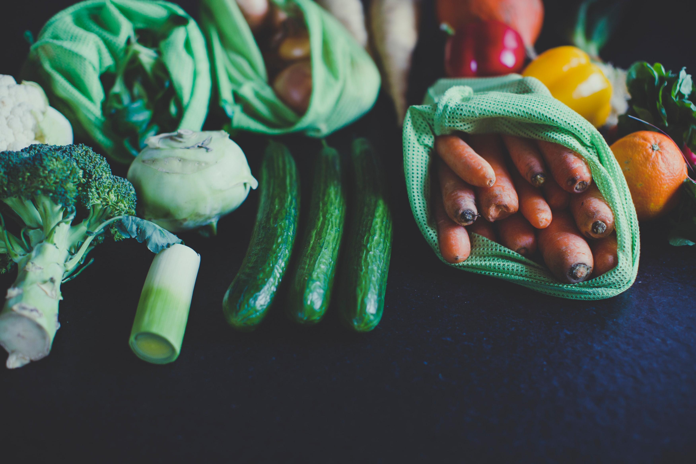

# Happy-Tofu-Vegetarian-Checker

Veggie Time!

This project utilizes the Open Food Facts API to determine if a food item is vegetarian or not. Enter a UPC barcode from any food item and watch as a list of ingredients is pulled. 

**Link to project:** https://happy-tofu.netlify.app

## How It's Made:

**Tech used:** HTML, CSS, JavaScript

Once a food item is provided in the input, a fetch is made via the Open Food Facts API. There are a few checks implemented before displaying the food item on the application. The first check is to ensure the user enters a valid UPC barcode. Once this is verified, another check is made to ensure the product is in the API, and includes both an image and a list of ingredients. If these checks are passed, the food item will be shown to the user. Using JavaScript, a table will be generated, appending new rows for each ingredient in the food item. If the ingredient is not known, a yellow background will show. If the ingredient is known to be non-vegetarian, a red background will show, indicating this food item is not vegetarian. 

## Optimizations

Further optimizations could be made by cleaning up the search results. In certain cases, some text will be shown as an ingredient when it is not truly an ingredient (e.g "less than 1% of" will be listed as an ingredient). This will require going through many different food items and throwing in conditionals to check for these instances. 

Each food item data from this API is not exactly the same (no schema is being used). For example, when searching for certain food items, the image url may be listed under the object property "image_url", while another food item might have the image url in an object property named "image". In order for the image to display to the user, more conditionals must be used to check for these cases. The application currently will only work for food items that contain both an "image_url" property and an "ingredients" property.  

## Lessons Learned:

-Using constructors for an OOP approach 
-Fetching from an API and using using promises 
-Modifying the DOM by appending rows to a table
